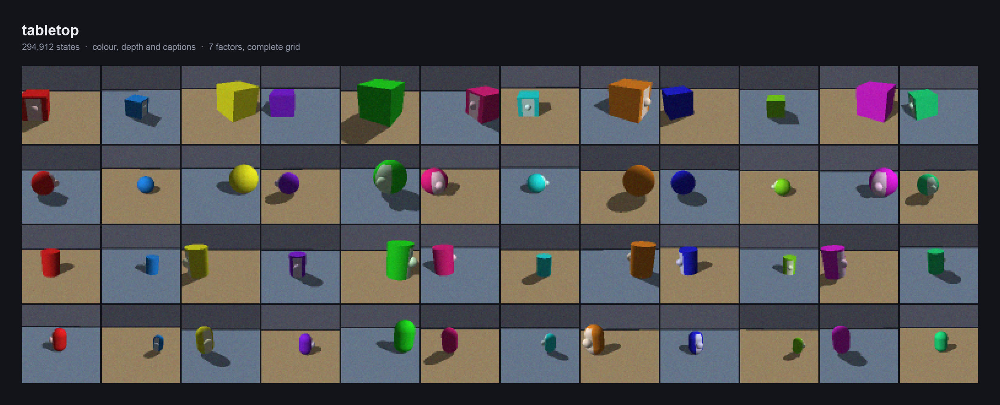
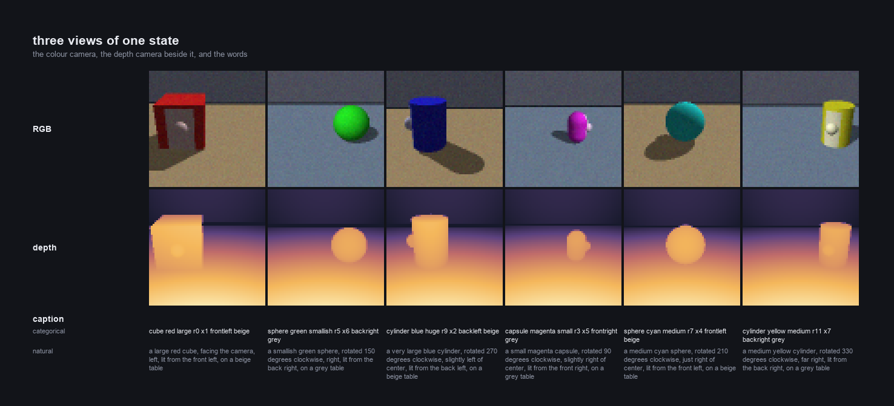
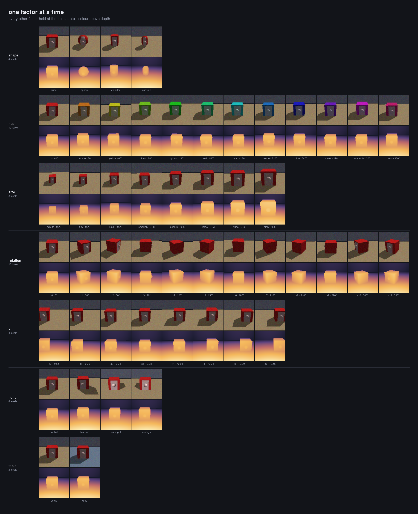
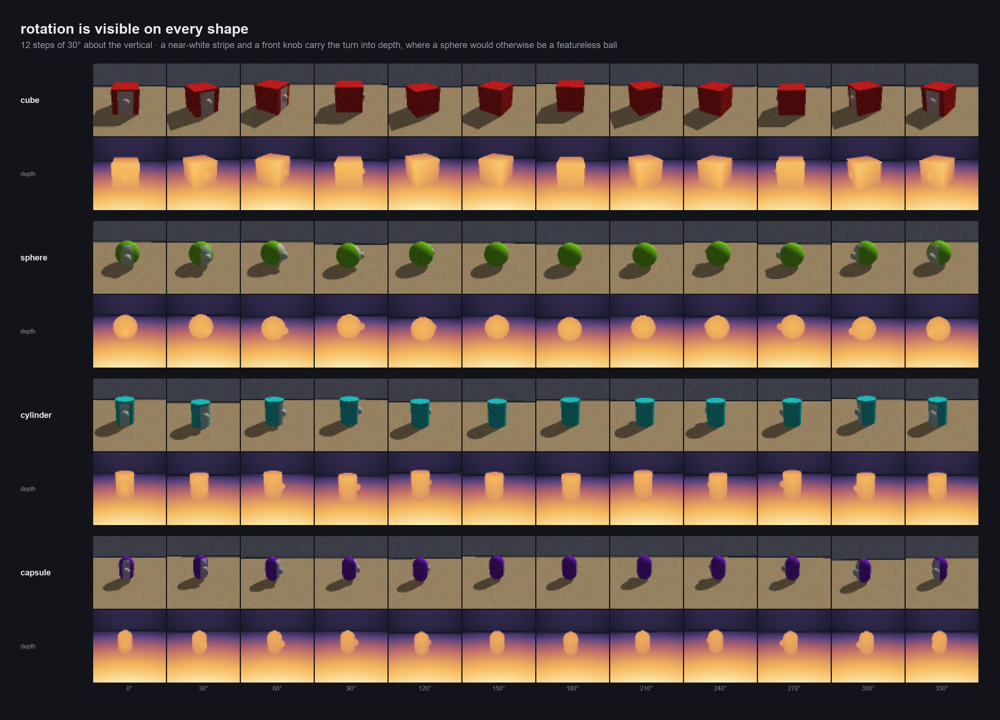
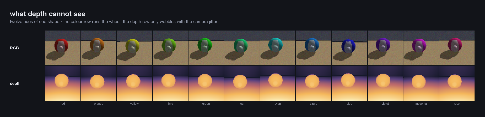
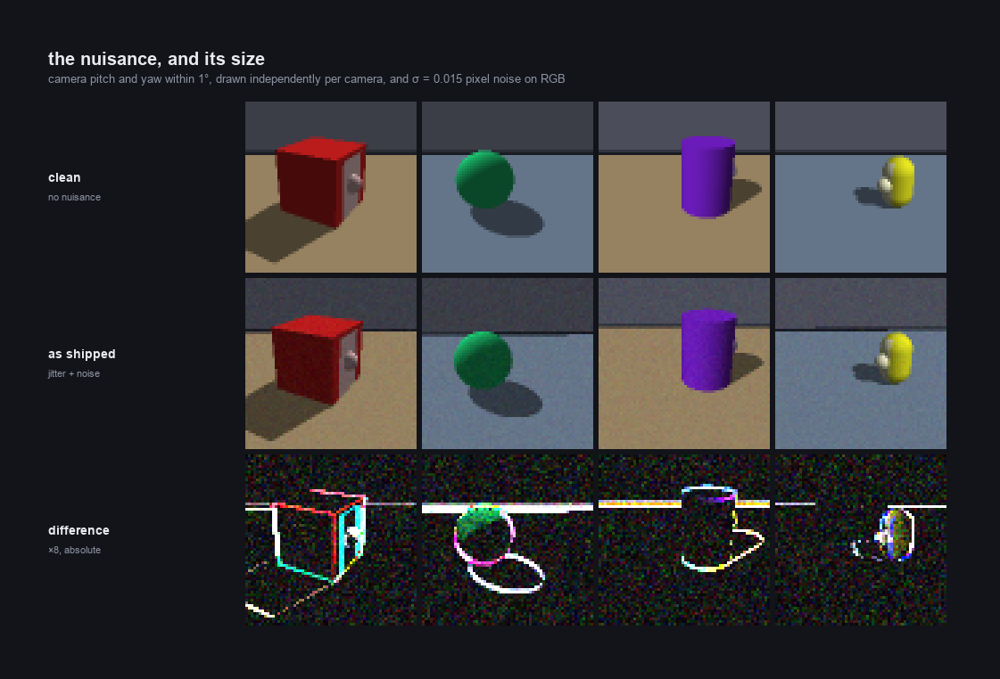

# tabletop

One object on a table, seen by a colour camera and a depth camera from the same
viewpoint, and described in words.



Every state of a complete seven-factor grid — 294,912 of them — is rendered
once by a small ray caster this repository owns. There is no scene file, no
renderer to install and no random sampling: a frame is a pure function of its
state index, so the dataset reproduces itself from the source in about six
minutes on ten cores, and a change to the nuisance is a re-render rather than a
new download.

It exists because the usual disentanglement grids answer only half the
question. Shapes3D and dSprites give you an image and a label vector; they do
not give you a second modality that provably cannot see some of the factors, a
factor with a known period, or a residual whose cause and size you set
yourself. Here all three are fixed in advance, by construction, and written
down below.

**Contents** · [Quick start](#quick-start) · [What is in it](#what-is-in-it) ·
[The factors](#the-factors) · [Captions](#captions) · [File layout](#file-layout) ·
[What the design fixes in advance](#what-the-design-fixes-in-advance) ·
[Rendering it yourself](#rendering-it-yourself) · [Verifying](#verifying) ·
[Version history](#version-history) · [Citing](#citing)

---

## Quick start

```bash
git clone https://github.com/anoopkcn/tabletop
cd tabletop
pip install -e .          # numpy and h5py; add '.[figures]' for pillow
```

The repository tracks `data/mini.h5`, a 512-state subset (8 MB) that touches
every factor — enough to write code against. Render the rest when you need it:

```bash
make dataset              # data/tabletop.h5, 294,912 states, ~4.9 GB, ~6 min on 10 cores
make smoke                # data/smoke.h5, a 6,144-state subset, complete on its own
make clean-grid           # data/tabletop_clean.h5, the same grid with no nuisance
```

Then read it:

```python
from tabletop import Tabletop

ds = Tabletop("data/mini.h5")
rgb, depth, levels = ds[0]          # uint8 [64,64,3], float [64,64] in scene units, int8 [7]

ds.caption(0)                       # 'cube red minute r0 x0 frontleft beige'
ds.caption(0, "natural")            # 'a very tiny red cube, facing the camera, far left, ...'

rows = ds.where(shape="sphere", rotation=[0, 6])     # every sphere at 0° or 180°
ds.value(rows[0], "size")           # 0.2 — the physical half-height, not the level index
```

Or skip the file altogether — the renderer is the dataset:

```python
from tabletop import render, state_levels

rgb, depth, jitter = render(state_levels(12_345))    # deterministic in the index
```

## What is in it



Three modalities of the same state, and each sees a different part of it. The
colour camera sees all seven factors. The depth camera sees four: hue, light
and table colour leave no trace in a depth map, which is a ceiling on what a
depth encoder can resolve, imposed by the scene rather than by the training
run. The caption sees all seven, in one of three vocabularies.

The two cameras share a viewpoint but not their jitter: each draws its own
pitch and yaw. That matters more than it sounds — see
[version history](#version-history).

## The factors



| # | factor | type | levels | values | in RGB | in depth | in the caption |
|---|---|---|---|---|---|---|---|
| 0 | shape | categorical | 4 | cube, sphere, cylinder, capsule | yes | yes | name |
| 1 | hue | periodic | 12 | HSV hue 0°, 30°, …, 330° | yes | **no** | colour word, or a run of `h` |
| 2 | size | continuous | 8 | bounding half-height 0.20 → 0.382, linear | yes | yes | size word, or a run of `z` |
| 3 | rotation | periodic | 12 | 0°, 30°, …, 330° about the vertical | yes | yes | `r0`–`r11`, or a run of `r` |
| 4 | x | continuous | 8 | −0.55 → 0.55 along the table, linear | yes | yes | `x0`–`x7`, or a run of `x` |
| 5 | light | periodic | 4 | azimuth 45°, 135°, 225°, 315°, elevation 45° | shading and shadow | **no** | frontleft, backleft, backright, frontright |
| 6 | table | categorical | 2 | beige, grey-blue | yes | **no** | name |

4 × 12 × 8 × 12 × 8 × 4 × 2 = **294,912 states**, stored row-major over the
columns above, so a state's row is `np.ravel_multi_index(levels, counts)` and
nothing else. The grid is complete: every combination is present exactly once.

Two nuisance variables are never captioned and never labelled as factors:
camera pitch and yaw jitter, uniform within 1° and drawn **independently for
each camera**, and Gaussian pixel noise with σ = 0.015 on RGB only. The four
jitter draws of every state are recorded in the file, so you can condition on
them or measure against them.

## Captions

Three vocabularies over the same seven levels. All three separate all 294,912
states — no two states share a caption in any variant.

```python
from tabletop import caption_categorical, caption_ordinal, caption_natural

levels = [0, 3, 4, 6, 2, 1, 0]        # cube, lime, medium, 180°, left of centre, back left, beige

caption_categorical(levels)   # 'cube lime medium r6 x2 backleft beige'
caption_ordinal(levels)       # 'cube h h h h z z z z z r r r r r r r x x x backleft beige'
caption_natural(levels)       # 'a medium lime green cube, rotated 180 degrees clockwise,
                              #  slightly left of center, lit from the back left, on a beige table'
```

- **categorical** — one token per level. The tokenizer learns twelve unrelated
  hue words and no ordering between them.
- **ordinal** — hue, size, rotation and x are written as run lengths: level `v`
  is `v + 1` repeats of one token. A caption can therefore name a level the
  encoder never saw by running longer, which is how you test extrapolation
  along a code rather than interpolation within one.
- **natural** — a fluent English sentence, for pretrained text encoders that
  never learned this scene. Rotation and position are the hard parts.

## File layout

Each grid is one HDF5 file, gzip level 1, chunked 256 frames at a time.

| dataset | dtype | shape | meaning |
|---|---|---|---|
| `images` | uint8 | [N, 64, 64, 3] | the colour camera |
| `depth` | uint16 | [N, 64, 64] | ray length, in units of `depth_max / 65535` |
| `labels` | int8 | [N, 7] | level index per factor |
| `values` | float32 | [N, 7] | physical value per factor, in `units` |
| `jitter` | float32 | [N, 4] | pitch and yaw of the colour camera, then of the depth camera, in degrees |
| `state_index` | int64 | [N] | the row's index in the full grid (identity for a full grid) |

File attributes: `factors`, `counts`, `units`, `depth_max` (8.0), `jitter_deg`,
`noise_std`, `nuisance`, `shapes`.

| file | states | size | what it is |
|---|---|---|---|
| `tabletop.h5` | 294,912 | 4.9 GB | the dataset |
| `tabletop_clean.h5` | 294,912 | 364 MB | the same grid with the nuisance switched off — the residual control |
| `smoke.h5` | 6,144 | 102 MB | hue, rotation ∈ {0,3,6,9}, x ∈ {0,3,7}, light ∈ {0,2}; a complete grid on its own |
| `mini.h5` | 512 | 8 MB | the subset tracked in git, for tests and for reading code |

### Getting the data

The `.h5` files are not in git (`data/mini.h5` aside). Either render them —
it is six minutes and the result is bit-identical in content to the published
files — or download the release assets and check them:

```bash
make dataset
python scripts/verify.py data/tabletop.h5 --against CHECKSUMS.txt
```

## What the design fixes in advance

Each of these is a property of the scene, not a result to be measured, so an
experiment can register a prediction against it before training anything.

**Rotation is resolvable on every shape, in both cameras.** A 30° turn of a
small round object barely changes its silhouette, so the object carries a
near-white stripe (30° half-width) on its front and a knob at mid height. In
depth, the knob is the only rotation cue a sphere has; the other three shapes
also turn their silhouette.



**Hue, light and table colour are absent from depth.** Not attenuated —
absent. A depth encoder's resolution on those three is bounded by the nuisance
alone, and the bound holds by construction rather than by assumption.



**The residual has a known cause and an adjustable size.** Shading couples
light to rotation and perspective couples x to size, so any interaction term
has a named source. Everything left over is the jitter and the pixel noise,
and `--no-nuisance` renders the same grid without either, which turns the
residual into a quantity you subtract rather than one you estimate.



**The periods are known.** Rotation and hue close after 12 levels; size and x
are straight lines in the world. Whatever code regime an encoder produces on
each can be compared against the truth instead of against another encoder.

**Extrapolation is testable.** The ordinal captions let a caption name a level
the encoder never saw, simply by running one token longer.

## Rendering it yourself

`tabletop/render.py` is the whole renderer: a perspective camera, Lambertian
shading with ambient light, one cast shadow against a finite table and a back
wall, 2 × 2 supersampling, four analytic primitives. It has no dependency
beyond numpy (and h5py to write a file).

```bash
python -m tabletop --out data/tabletop.h5 --workers 10     # the grid
python -m tabletop --out data/smoke.h5 --smoke             # 6,144 states
python -m tabletop --out data/mini.h5 --mini               # 512 states
python -m tabletop --out data/clean.h5 --no-nuisance       # no jitter, no pixel noise
python -m tabletop --preview assets/preview.png            # a one-row-per-factor sheet
python -m tabletop --time                                  # ms per frame on this machine
```

About 11 ms per frame on one core of an M-series laptop; the full grid is
roughly 55 core-minutes, or six minutes across ten workers.

The README figures come from the renderer too, not from a data file:

```bash
python scripts/make_demo_images.py                 # all six, into assets/
python scripts/make_demo_images.py --only rotation --scale 4
```

### Changing the scene

The constants at the top of `render.py` are the scene. Raising `JITTER_DEG` or
`NOISE_STD` and re-rendering gives a grid with a larger residual and nothing
else changed; `H`, `W` and `SS` set the resolution and the supersampling;
`STRIPE_HALF_DEG` and `KNOB_R` set how loudly rotation is announced. A grid
rendered with different constants is a different dataset — re-run
`scripts/verify.py` and keep its digests alongside.

## Verifying

```bash
python scripts/verify.py data/*.h5 --against CHECKSUMS.txt
python scripts/verify.py data/mini.h5 --rerender 64      # re-render rows, compare pixel for pixel
python -m pytest -q                                      # 35 tests, ~3 s
```

`CHECKSUMS.txt` carries two digests per file. The first is sha256 of the bytes
and verifies a download. The second is sha256 over the arrays in row order and
is what a re-render reproduces — HDF5 is free to lay out the same data
differently between library versions, so a freshly rendered grid is expected
to match the second and need not match the first.

The test suite asserts the guarantees above rather than the implementation:
that captions are unique across the whole grid, that hue, light and table do
not reach the depth image, that rotation reaches both cameras on all four
shapes, and that the two cameras jitter independently.

## Version history

**Version 2** (2026-09-16, current) — rotation at 12 levels of 30°, a
near-white stripe of 30° half-width, a knob of 0.30 relative size, jitter drawn
independently per camera and bounded at 1°. 294,912 states.

**Version 1** (2026-09-16, earlier) — rotation at 24 levels of 15°, a darkened
stripe, a knob of 0.22, one jitter draw of up to 1.5° shared by both cameras.
589,824 states. Withdrawn after its first encoders exposed two design faults,
both visible before any test result was read:

- a 15° rotation of a small round object changed the image about ten times less
  than the jitter did, so rotation was unresolvable on three of the four shapes;
- depth→RGB retrieval found the exact state in 43% of validation queries, which
  is impossible from geometry alone — the shared jitter draw was acting as a
  per-state fingerprint across the two modalities.

Version 2 fixes both. Nothing else published uses version 1.

## Citing

```bibtex
@misc{tabletop2026,
  author = {K. Chandran, Anoop},
  title  = {tabletop: a complete factor grid in colour, depth and words},
  year   = {2026},
  url    = {https://github.com/anoopkcn/tabletop},
  note   = {Version 2.0.0}
}
```

`CITATION.cff` carries the same metadata in a machine-readable form.

## Where it came from

The grid was built for a study of embedding arithmetic between frozen encoders
sharing one space, where it replaced Shapes3D as the single dataset. It is
published separately because the guarantees above are useful on their own —
for disentanglement, for cross-modal retrieval, for probing what a depth
encoder can and cannot represent, and as a controlled setting for measuring a
residual instead of assuming one.

## License

MIT, covering both the renderer and the data it generates. See `LICENSE`.
